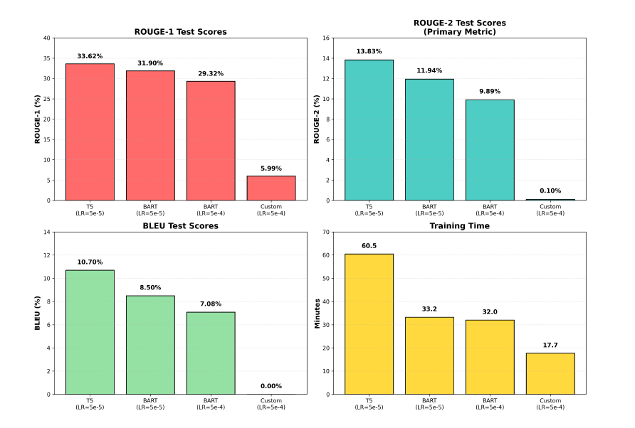
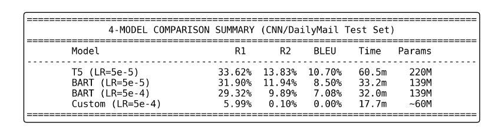
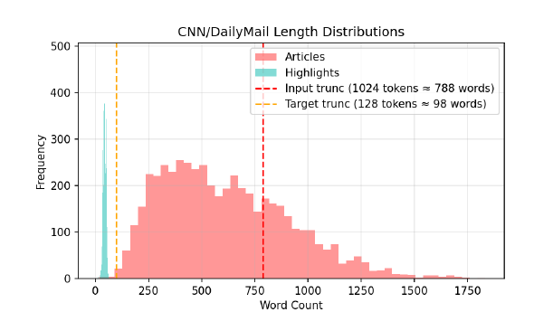

# Abstractive Summarization with Transformers

Comparative study between **pre-trained transformer models** (T5, BART) and a **custom encoder–decoder architecture** for abstractive text summarization on the [CNN/DailyMail](https://huggingface.co/datasets/cnn_dailymail) dataset.

> MSc coursework — Deep Neural Networks, National and Kapodistrian University of Athens, 2026.

---

## Overview

This project investigates the effectiveness of **transfer learning in NLP** by comparing pretrained transformer models against a custom-built encoder–decoder model trained from scratch.

The goal is to evaluate performance on **abstractive summarization**, where models must generate concise summaries rather than extract sentences directly from the input.

---

## Key Results

| Model | ROUGE-1 | ROUGE-2 | BLEU | Training Time |
|------|--------|--------|------|--------------|
| **T5-base** | **33.62%** | **13.83%** | **10.70%** | ~60 min |
| BART-base | 31.90% | 11.94% | 8.50% | ~33 min |
| BART (lr=5e-4) | 29.32% | 9.89% | 7.08% | ~32 min |
| Custom Encoder-Decoder | 5.99% | 0.10% | 0.00% | **17.7 min** |

-  **T5-base achieves the best performance across all metrics**
-  Pretrained models significantly outperform the custom model
-  Training from scratch leads to very poor generalization
-  Custom model is faster but ineffective → trade-off between speed and performance

---

##  Results Visualization

### Model Performance Comparison


---

### Summary Table


---

### Dataset Analysis


---

##  Repository Structure

```
abstractive-summarization-transformers/
│
├── abstractive_summarization.ipynb  # Full pipeline (training & evaluation)
├── assets/                          # Figures used in README
├── README.md
├── .gitignore
└── LICENSE
```

---

##  Dataset

**CNN/DailyMail Dataset**

- ~300,000 news articles with human-written summaries
- Task: generate abstractive summaries
- Input truncated to ~1024 tokens, summaries to ~128 tokens

> Dataset loaded via Hugging Face `datasets` library

---

##  Methodology

### Preprocessing
- Tokenization using SentencePiece (T5, BART)
- Input truncation to 1024 tokens
- Output truncation to 128 tokens
- Padding for batch processing

### Models

**Pretrained Models:**
- **T5-base** — text-to-text transformer trained on large corpus
- **BART-base** — denoising encoder–decoder transformer

**Custom Model:**
- Encoder–Decoder Transformer trained from scratch (~60M parameters)
- No pretraining → learns from dataset only

### Training Setup
- 2 epochs
- Batch size: 4
- FP16 training
- Beam search decoding
- Same hyperparameters for fair comparison

---

##  How to Run

### 1. Clone the repository
```bash
git clone https://github.com/annaallayioti/abstractive-summarization-transformers.git
cd abstractive-summarization-transformers
``` 
### 2. Install dependencies
```bash
pip install transformers datasets evaluate rouge-score sentencepiece torch
```

### 3. Run the notebook
```bash
jupyter notebook abstractive_summarization.ipynb
```

## Tech Stack
`Python` `PyTorch` `transformers` `datasets` `evaluate` `numpy` `matplotlib`

## Authors

- Anna Allagioti  
- Maria-Konstantina Karkoglou  

## License
This project is licensed under the MIT License.
